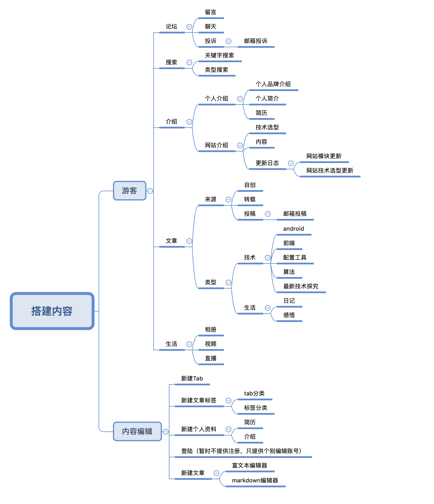

# 从零开始搭建一博客系统

> 之前用hexo搭建了个个人博客，然后觉得这个博客系统比较的不方便。也觉得功能没有达到自己想要的效果。
一顿考量之后就决定自己买一个服务器来自己写一个，暂时只能想到的框架图是比较简单的，想先写一个出来后续的 再根据个人的
喜好来进行调整。

### 技术选型：

+ 前端：
    
    - 技术框架用vue3.0
    - webpack4.0做模块打包器
    - stylus做css预语言（别问我为什么不用）
    - ci自动部署，并且将项目静态资源放在云端
    - 视频、图片等文件放在七牛云盘
    - 项目繁忙，暂时只想到这么多，策划，视图都是自己想的 真真恼死我了
    
+ 后台：
    
    - 技术选型：go or springboot
    - 想用docker，但是不会 得学
    - 想用nginx，但是不会 得学
    - 状态：我会一点点springboot 但是公司用的是go。说到底还是得学..
    
+  android端：

    - 技术选型：flutter or kotlin
    - 状态：待定；这俩都会，但是按照技术的优先级来说 kotlin 比较熟悉，做的项目比较多 flutter刚接触，基本的都会
    
+ 小程序：    

    - 技术选项：原生
    - 状态： 待定；

+ ios：不会，就算了 哈哈哈

### 项目功能介绍：

上面是我自己做的一个功能的初步设想，如果后续有更新，会逐步调整此文档的。我在做的同时也会将项目中的问题，以及解决办法逐个开放出来，如果存在不同见解，
请通过项目内的邮箱、评论等方式私聊。

`写文档/文章不易，如果单纯就是为了装逼 我不一定会回的。本人脾气也不好`